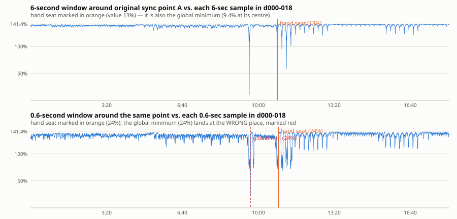
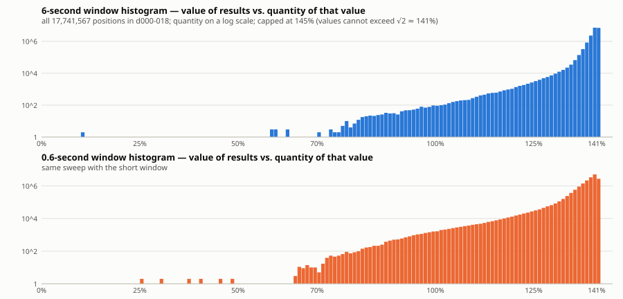
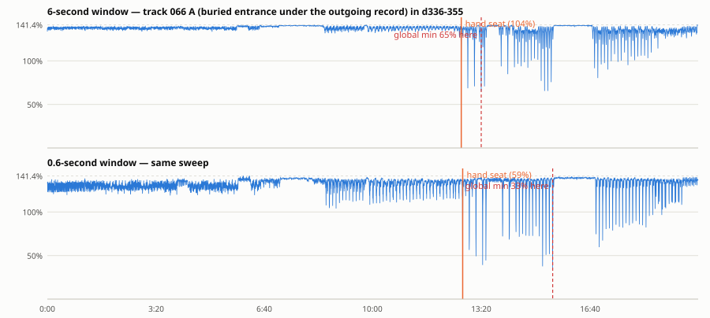
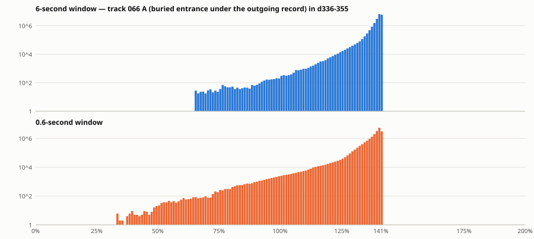
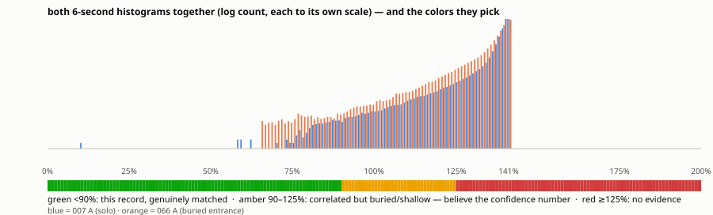

# Sync-sweep calibration — two alignment points vs every position in their captures

**What this is:** the calibration survey for the align tool's colors, done the exhaustive
way: take a hand-verified alignment point and compare its slice of the original track
against **every single sample position** of the stream capture that contains it. Three
results, as specified: (1) the full list of alignment values — one per possible position;
(2) a histogram of those values; (3) a proposed color scale drawn on the same axis,
picked using **both** histograms together.

Two deliberately opposite cases:

- **Track 007 "You're My Life", point A** in `d000-018` — the record playing **alone**.
- **Track 066, point A** in `d336-355` — the record's **entrance, buried under the
  outgoing record** ("first four-note").

Reproduce: `PYTHONPATH=scripts .venv/bin/python -m streamalign sync-sweep 7 A --json out.json`
(and `66 A`; see the seat-correction note below).

## How to read the numbers (plain-language definitions)

- **The alignment value ("residual", a percentage).** At each candidate position we
  place the original's slice against the stream, turn its volume up or down so both are
  equally loud, subtract one from the other (both polarities, keeping the better), and
  measure **how loud the leftover is compared to the stream slice itself**. `0%` = the
  subtraction cancelled everything. `100%` = the leftover is as loud as the stream was.
  Lower = better match.

- **Why wrong positions read ~141%, not ~100%.** Subtracting something *unrelated*
  doesn't cancel anything — it effectively **adds** a second, equally loud signal
  (loudnesses of unrelated sounds combine by power, like independent noise), and two
  equally-loud unrelated signals total √2 ≈ 1.414× the loudness of one. So **141% is
  the signature of "no relationship at all"** — not a floor to aspire to, but the pile
  where wrong seats land.

- **The "wrong-place cluster."** In both sweeps, the overwhelming majority of the
  ~17–19 million positions land in a narrow pile at 138–142% (the giant spike in every
  histogram). Because that pile is so narrow, **values clearly below ~130% are real
  evidence** — wrong places essentially never produce them.

- **"Verified seat."** A hand-marked alignment point (`origNNN sync:` label) that the
  correlation analysis confirms when started from the hand mark.

## Case 1 — track 007 A: the record playing alone

**17,741,567 positions** for the 6-second window. The full list, drawn as the deepest
value in each ¼ second:

- One dramatic trench at the hand seat, down to **9.4%** — the global minimum of all
  17.7 M positions **is** the hand-marked seat. Only **311 positions read below 90%**,
  all within a few milliseconds of the seat: a green reading here is essentially
  impossible to get by accident.
- The **0.6-second window** (bottom panel) is far noisier: its global minimum lands at
  the **wrong place** (a passage that happens to resemble the slice), essentially tied
  with the true seat. **Short windows position; only long windows decide.**

## Case 2 — track 066 A: a buried entrance (the hard case, on request)

A bookkeeping note first: this point's label file has only one `orig066 start:` row, and
the corpus audit measured its three verified neighbouring points (sync 1/2/3, same clip
seating) all sitting at a consistent **+3.13 s** bookkeeping error — so the seat here was
reconstructed with that correction applied, after which the correlation locks (confidence
0.46) exactly there. The entrance itself is quiet under the outgoing record, which is the
point of this case.

- At the **true seat the residual is ~104%** — *amber*, while being exactly right. The
  record is simply buried: after a correct subtraction, what remains is the *other*
  record the DJ is playing over it.
- The **global minimum (65%) is NOT the seat**: the record's intro figure recurs later
  in the track, where the mix has become mostly this record — so the same slice matches
  *better* a few bars later. On loop-built music, **a green reading pins the record but
  not necessarily the bar**; picking the bar is the job of the correlation confidence,
  distinct anchor moments, and the ear — exactly the existing labelling practice.
- The wide shoulder of values 65–135% (absent in case 1) is the record's own play-span:
  a few minutes of the capture genuinely contain this audio at varying exposure.

## The colors, picked from both histograms together

| Color | Range | Meaning, in these units |
|---|---|---|
| **green** | **below 90%** | Genuine match of material — unreachable by accident (007: 311 of 17.7 M positions; 066: only within the record's actual play-span). On loopy passages it identifies the *record*, not always the *bar*. |
| **amber** | **90–125%** | Correlated but shallow. This is what a **correct seat in a busy mix looks like** (066 A reads 104% while exactly right). Believe the confidence number and the ear here. |
| **red** | **≥ 125%** | Statistically indistinguishable from a wrong seat (the wrong-place cluster's rare outliers reach ~125–130%). |

And the rule the two cases force: **the residual measures how *exposed* the record is;
the correlation confidence measures whether the *alignment* is right.** 007 A and 066 A
are both perfect seats — one reads 9%, the other 104%. The align tool therefore shows
the confidence with equal billing beside the color, and treats the 10%-point window as a
fine-positioning aid, never the verdict.

Final tuning of the exact band edges happens interactively in the inspector.
