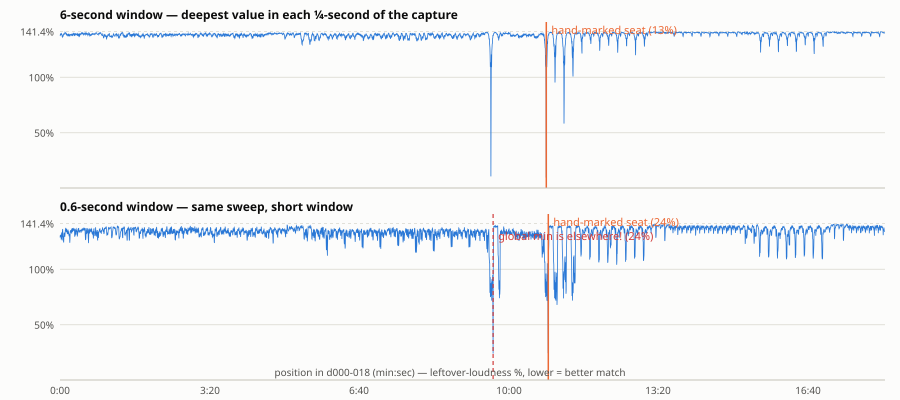
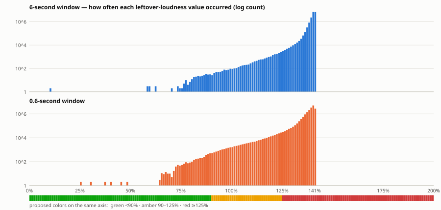

# Sync-sweep calibration — one alignment point vs every position in its capture

**What this is:** the calibration survey for the align tool's colors, done the exhaustive
way: take ONE hand-verified alignment point, and compare its slice of the original track
against **every single sample position** of the stream capture that contains it. Three
results, as specified: (1) the full list of alignment values — one per possible position;
(2) a histogram of those values; (3) a proposed color scale drawn on the same axis.

Produced by `streamalign sync-sweep 7 A` (track 007 "You're My Life", sync point A, inside
capture `d000-018`, ~18 minutes of stream). Reproduce with:

```
PYTHONPATH=scripts .venv/bin/python -m streamalign sync-sweep 7 A --json out.json
```

## How to read the numbers (plain-language definitions)

- **The alignment value ("residual", shown as a percentage).** At each candidate
  position we place the original's 6-second slice against the stream, turn its volume up
  or down so both are equally loud, subtract one from the other (trying both polarities,
  keeping the better), and measure **how loud the leftover is compared to the stream
  slice itself**. `0%` = the subtraction cancelled everything (perfect match). `100%` =
  the leftover is just as loud as the stream was. Lower = better match.

- **Why wrong positions read ~141%, not ~100%.** Subtracting something *unrelated*
  doesn't cancel anything — it effectively **adds** a second, equally loud signal on top
  (loudnesses of unrelated sounds combine by power, like independent noise). Two
  equally-loud unrelated signals sum to √2 ≈ 1.414 times the loudness of one. That's the
  whole meaning of the √2 number: **141% is what "no relationship at all" looks like** on
  this meter. It's not a floor you'd like to reach — it's the signature of a wrong seat.

- **The "wrong-place cluster."** Across ~17.7 million positions, almost every value
  lands in a very narrow pile around 138–142% (see the histogram's giant spike). That
  narrowness is good news: it means **any value clearly below ~130% is real evidence of
  a match**, because wrong places essentially never produce it.

- **"Verified seat."** A hand-marked alignment point (an `origNNN sync:` label) that the
  audio analysis confirms: the correlation search, started from the hand mark, locks
  onto a sharp peak there.

## Result 1 — the full list of alignment values

**17,741,567 values** for the 6-second window (the stream's 17.65 M samples plus the
positions where the window overhangs either end — the "nearly twice as long" bookkeeping
collapses to +1 window because one end's overhang is the other's tail). The curve below
is that list, drawn as the deepest value in each ¼ second so it fits on a screen; every
dip below the 141% line is a place where the slice genuinely resembles the stream.



What it shows:

- **6-second window (top):** one dramatic trench at 10:50 — the hand-marked seat — down
  to **9.4%**, the deepest value of all 17.7 million. The hand seat IS the global
  minimum. Of all positions, only **311 fall below 90%**, and they are the immediate
  neighbourhood of the seat (a few milliseconds each side): green readings are
  essentially impossible to get by accident.
- **0.6-second window (bottom):** the same sweep with the align tool's short "point"
  window is far noisier — its global minimum (23.8%) lands at **the wrong place**
  (9:39, a passage that happens to resemble the slice), essentially tied with the true
  seat's own 24.2%. **Short windows narrow the search; only the long window decides.**

## Result 2 — the histogram

Alignment value on the X axis, number of positions with that value on the Y axis
(logarithmic — the wrong-place spike would otherwise flatten everything else).



The giant spike at 138–142% is the wrong-place cluster (millions of positions). The thin
tail stretching left is real resemblance — loop echoes, similar passages — and the lone
values below 20% are the seat itself.

## Result 3 — the proposed colors (drawn on the same axis above)

| Color | Range | Meaning, in these units |
|---|---|---|
| **green** | **below 90%** | Real match, essentially impossible by accident (311 of 17.7 M positions here, all at the seat). The subtraction removed most of the stream — the record is *exposed* and correctly seated. |
| **amber** | **90–125%** | Correlated but shallow. Normal at a correct seat in a *busy* passage (see below) — trust the confidence number and your ear. |
| **red** | **≥ 125%** | Statistically indistinguishable from a wrong seat (the wrong-place cluster starts at ~130%, and its rare outliers reach ~125%). |

Two caveats, both visible in this data:

- **A shallow (amber) reading does not mean a bad alignment.** After a *correct*
  subtraction, what's left is **everything else the broadcast contained at that moment**:
  the second record the DJ layered in, voiceover, EQ and codec artifacts. Track 007 A
  nulls to 9% because the record was playing alone; an equally-perfect seat where the DJ
  is blending two records at similar loudness leaves the other record behind — reading
  70–110% while being exactly right. **The residual measures how *exposed* the record
  is; the correlation confidence measures whether the *alignment* is right.** That's why
  the align tool shows both, and why the confidence (verified seats reach 0.99+, wrong
  places idle near 0.02) is the number to believe when the color is amber.
- **These thresholds are from one clean case** plus the corpus-wide audit
  (`sync-audit`: 63 verified seats between 12% and ~130%, wrong-place cluster identical
  across all files). Final tuning happens interactively in the inspector.

## Where this leaves the align tool

The inspector's residual meter gets the color scale above (log-graded within each band),
anchored to the wrong-place cluster rather than to wishful absolute numbers; the refine
**confidence** is promoted to equal billing beside the color; and the 10%-point window
keeps its role as a *fine-positioning* aid — never the verdict, which this sweep shows it
cannot deliver alone.
